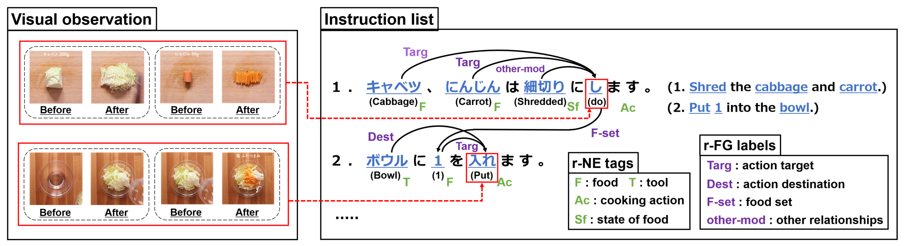

# Visual-Recipe-Flow



This repository contains the annotations and scripts to download data used in [Visual Recipe Flow: A Dataset for Learning Visual State Changes of Objects with Recipe Flows](https://aclanthology.org/2022.coling-1.315).

## Download Data
`annotations.json` contains only NE tags, recipe flows based on word IDs, and frame IDs. To download recipes and cooking videos run the following script.
~~~
$ zsh ./scripts/download_recipes.zsh
~~~
This script automatically creates files for tokenized words of ingredient and instruction texts (`ingredients.tok` and `instructions.tok`).

## Citation
```
@inproceedings{shirai-etal-2022-visual,
    title = "Visual Recipe Flow: A Dataset for Learning Visual State Changes of Objects with Recipe Flows",
    author = "Shirai, Keisuke  and
      Hashimoto, Atsushi  and
      Nishimura, Taichi  and
      Kameko, Hirotaka  and
      Kurita, Shuhei  and
      Ushiku, Yoshitaka  and
      Mori, Shinsuke",
    booktitle = "Proceedings of the 29th International Conference on Computational Linguistics",
    month = oct,
    year = "2022",
    address = "Gyeongju, Republic of Korea",
    publisher = "International Committee on Computational Linguistics",
    url = "https://aclanthology.org/2022.coling-1.315",
    pages = "3570--3577",
}
```

## License
MIT license


